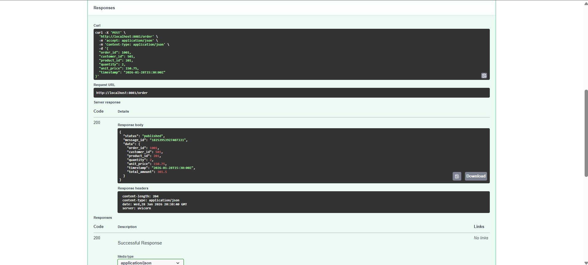
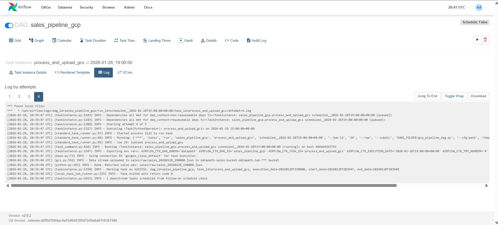
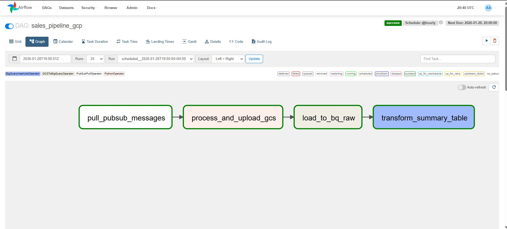
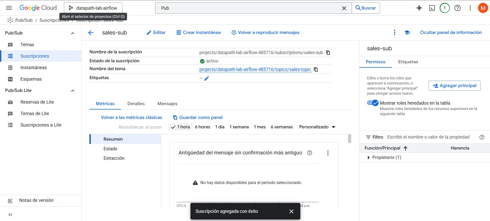
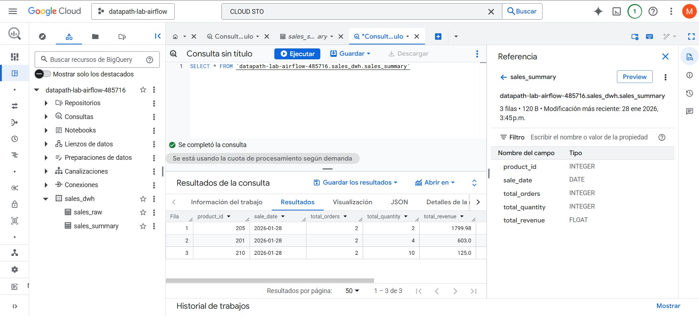

# Pipeline de Datos con Apache Airflow y Google Cloud Platform

**Estudiante:** Miguel Angel Peña Carrillo

---

## 📋 Descripción del Pipeline

Este proyecto implementa un pipeline completo de ingeniería de datos utilizando **Apache Airflow** orquestado con **Docker Compose** e integrado con servicios de **Google Cloud Platform (GCP)**. El pipeline automatiza el flujo de datos desde su generación hasta su transformación y almacenamiento en un data warehouse.

### Arquitectura del Pipeline

El pipeline consta de los siguientes componentes:

1. **Sales API**: Servicio REST que genera datos de ventas y los publica en Google Cloud Pub/Sub
2. **Google Cloud Pub/Sub**: Sistema de mensajería que recibe y almacena eventos de ventas
3. **Apache Airflow**: Orquestador que coordina las siguientes tareas:
   - 📥 Extracción de mensajes desde Pub/Sub
   - 🔄 Procesamiento y transformación de datos
   - ☁️ Carga de datos a Google Cloud Storage (GCS)
   - 📊 Ingesta de datos a BigQuery (tabla raw)
   - 🧮 Transformación y agregación en BigQuery (tabla summary)

### Flujo de Datos

```
Sales API → Pub/Sub → Airflow DAG → GCS → BigQuery (Raw) → BigQuery (Summary)
```

El DAG de Airflow (`sales_pipeline_gcp`) ejecuta las siguientes tareas en secuencia:

- **pull_pubsub_messages**: Extrae hasta 10 mensajes de la suscripción `sales-sub`
- **process_and_upload_gcs**: Procesa los mensajes y los sube a GCS en formato NDJSON
- **load_to_bq_raw**: Carga los datos desde GCS a BigQuery en la tabla `sales_raw`
- **transform_summary_table**: Crea tabla agregada `sales_summary` con métricas por producto y fecha

---

## 🚀 Instrucciones de Ejecución

### Prerrequisitos

- Docker Desktop instalado y en ejecución
- Credenciales de Google Cloud Platform (`google_credentials.json`)
- Archivo `.env` configurado con las variables de entorno necesarias

### Pasos para Ejecutar el Proyecto

1. **Clonar el repositorio y navegar al directorio del proyecto**
   ```bash
   cd "c:\Users\cmigu\Desktop\Road to Data Engineer\Módulo 6 - Ingeniería de Datos Avanzada con Python\airflow-gcp-lab\airflow-gcp-lab\lab_final"
   ```

2. **Verificar que los archivos de configuración estén presentes**
   - `google_credentials.json` en la raíz del proyecto
   - `.env` con las variables `GCP_PROJECT_ID` y `AIRFLOW_UID`

3. **Construir las imágenes de Docker**
   ```bash
   docker-compose build
   ```

4. **Iniciar todos los servicios**
   ```bash
   docker-compose up -d
   ```

5. **Verificar que los contenedores estén ejecutándose**
   ```bash
   docker-compose ps
   ```

6. **Acceder a la interfaz de Airflow**
   - URL: http://localhost:8080
   - Usuario: `airflow`
   - Contraseña: `airflow`

7. **Acceder a la Sales API**
   - URL: http://localhost:8081
   - Endpoint para generar ventas: `POST http://localhost:8081/api/sales`

### Comandos Útiles

```bash
# Ver logs de todos los servicios
docker-compose logs -f

# Ver logs de un servicio específico
docker-compose logs -f airflow-scheduler

# Detener todos los servicios
docker-compose down

# Detener y eliminar volúmenes (reinicio completo)
docker-compose down -v

# Reiniciar un servicio específico
docker-compose restart airflow-webserver
```

---

## 📸 Evidencia del Proyecto

### 1. Sales API - Envío de Órdenes

Captura de Swagger UI (`/docs`) o Postman mostrando una respuesta exitosa (200 OK) al enviar una orden de venta.



---

### 2. Interfaz de Airflow - Vista del DAG

Captura de la vista Grid/Graph del DAG `sales_pipeline_gcp` con todas las tareas en verde (Success).



---

### 3. Logs de Procesamiento en Airflow

Captura de los logs de la tarea `process_and_upload_gcs` mostrando que procesó mensajes correctamente.



---

### 4. Google Cloud Platform - Pub/Sub

Captura de la consola de Pub/Sub mostrando el Topic `sales-topic` y la Subscription `sales-sub` creados.



---

### 5. Google Cloud Platform - BigQuery

Captura de BigQuery mostrando el esquema de la tabla `sales_summary` creada y una consulta (SELECT *) con los datos cargados.



---

## 🛠️ Tecnologías Utilizadas

- **Apache Airflow 2.6.2**: Orquestación de workflows
- **Docker & Docker Compose**: Containerización y orquestación de servicios
- **Google Cloud Pub/Sub**: Sistema de mensajería
- **Google Cloud Storage**: Almacenamiento de datos
- **Google BigQuery**: Data Warehouse
- **PostgreSQL**: Base de datos para metadatos de Airflow
- **Redis**: Backend de Celery para ejecución distribuida
- **Flask**: Framework para la Sales API

---

## 📁 Estructura del Proyecto

```
lab_final/
├── .env                        # Variables de entorno
├── docker-compose.yaml         # Configuración de servicios
├── Dockerfile                  # Imagen personalizada de Airflow
├── google_credentials.json     # Credenciales de GCP
├── app/                        # Sales API
│   ├── Dockerfile
│   └── main.py
├── dags/                       # DAGs de Airflow
│   └── gcp_pipeline_dag.py     # Pipeline principal
├── logs/                       # Logs de Airflow
├── plugins/                    # Plugins personalizados
└── config/                     # Configuraciones adicionales
```

---

## 📝 Notas Adicionales

- El pipeline se ejecuta automáticamente cada hora (`@hourly`)
- Se pueden generar ventas manualmente usando la Sales API
- Los datos se procesan en formato NDJSON para compatibilidad con BigQuery
- Las tablas en BigQuery se crean automáticamente si no existen
- La tabla `sales_summary` se recrea completamente en cada ejecución (CREATE OR REPLACE)

---

## 🎯 Objetivos de Aprendizaje Logrados

✅ Implementación de un pipeline de datos end-to-end  
✅ Orquestación con Apache Airflow en Docker  
✅ Integración con servicios de Google Cloud Platform  
✅ Procesamiento de mensajes en streaming (Pub/Sub)  
✅ Almacenamiento y transformación en BigQuery  
✅ Automatización de workflows de datos  

---

**Proyecto desarrollado para el Módulo 6 - Ingeniería de Datos Avanzada con Python**